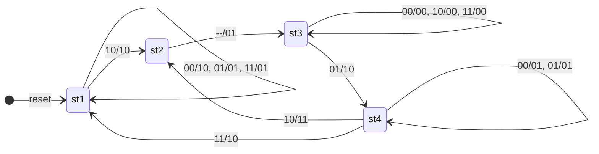

# 2-bit Input / 2-bit Output Mealy State Machine (VHDL)

情報理工学実験Bのハードウェア記述言語における、ステートマシン回路をVHDLで実装したもの。動作記述と構造記述の両方で同等の回路を記述している。Quartus Prime / ModelSim でシミュレーション・論理合成を確認済み。

## 概要

| 項目 | 内容 |
|------|------|
| 入力 | `x[1:0]` (2 bit), `clock`, `reset` |
| 出力 | `y[1:0]` (2 bit) |
| 状態数 | 4 (st1, st2, st3, st4) |
| 種類 | Mealy 型 (出力が現在状態と入力の両方に依存) |
| リセット | 非同期 (reset = '1' で st1 へ初期化) |

## ファイル構成

```
.
├── state_machine_behave.vhd          # 動作記述 (behavioral)
├── state_machine_behave_test.vhd     # 動作記述用テストベンチ
├── state_machine_struct.vhd          # 構造記述 (structural)
├── state_machine_struct_test.vhd     # 構造記述用テストベンチ
├── myand2.vhd                        # 基本部品: 2入力 AND
├── myor2.vhd                         # 基本部品: 2入力 OR
├── mynot.vhd                         # 基本部品: NOT
└── mydiff.vhd                        # 基本部品: D フリップフロップ (非同期リセット)
```

## 状態遷移図



ラベルは `入力x1x0 / 出力y1y0` の形式。st2 は入力に依存せず常に st3 へ遷移するため `--/01` と表記している。

## 状態遷移表

| 現状態 | x1 x0 | 次状態 | y1 y0 |
|:------:|:-----:|:------:|:-----:|
| st1 | 00 | st1 | 10 |
| st1 | 01 | st1 | 01 |
| st1 | 10 | st2 | 10 |
| st1 | 11 | st1 | 01 |
| st2 | -- | st3 | 01 |
| st3 | 00 | st3 | 00 |
| st3 | 01 | st4 | 10 |
| st3 | 10 | st3 | 00 |
| st3 | 11 | st3 | 00 |
| st4 | 00 | st4 | 01 |
| st4 | 01 | st4 | 01 |
| st4 | 10 | st2 | 11 |
| st4 | 11 | st1 | 10 |

## 状態エンコーディング (構造記述)

構造記述では状態を 2 ビットでバイナリエンコードしている。

| 状態 | q1 q0 |
|:----:|:-----:|
| st1 | 00 |
| st2 | 01 |
| st3 | 10 |
| st4 | 11 |

## 次状態方程式・出力方程式

カルノー図によって導出した式。積 (AND) は変数の並置、和 (OR) は `+`、否定 (NOT) は上付きバーで表す。

### 次状態

$$D_1 = \overline{q_1} q_0 + q_1 \overline{q_0} + q_1 q_0 \overline{x_1}$$

$$D_0 = \overline{q_1}\, \overline{q_0}\, x_1 \overline{x_0} + q_1 \overline{q_0}\, \overline{x_1} x_0 + q_1 q_0 (\overline{x_1} + \overline{x_0})$$

### 出力

$$y_1 = \overline{q_1}\, \overline{q_0}\, \overline{x_0} + q_1 \overline{q_0}\, \overline{x_1} x_0 + q_1 q_0 x_1$$

$$y_0 = \overline{q_1}\, \overline{q_0}\, x_0 + \overline{q_1} q_0 + q_1 q_0 (\overline{x_1} + \overline{x_0})$$

## 使い方 (Quartus Prime / ModelSim)

### Quartus Prime での論理合成

1. 新規プロジェクトを作成
2. 上記の `.vhd` ファイルをすべて追加
3. Top-level entity を `state_machine_behave` または `state_machine_struct` に設定
4. `Processing → Start → Start Analysis & Synthesis`
5. `Tools → Netlist Viewers → RTL Viewer` でネットリストを確認

### ModelSim でのシミュレーション

```tcl
# コンパイル
vcom myand2.vhd myor2.vhd mynot.vhd mydiff.vhd
vcom state_machine_behave.vhd state_machine_behave_test.vhd
vcom state_machine_struct.vhd state_machine_struct_test.vhd

# シミュレーション (動作記述)
vsim work.state_machine_behave_test
add wave *
run 2000ns

# シミュレーション (構造記述)
vsim work.state_machine_struct_test
add wave *
run 2000ns
```

## ライセンス

MIT License
